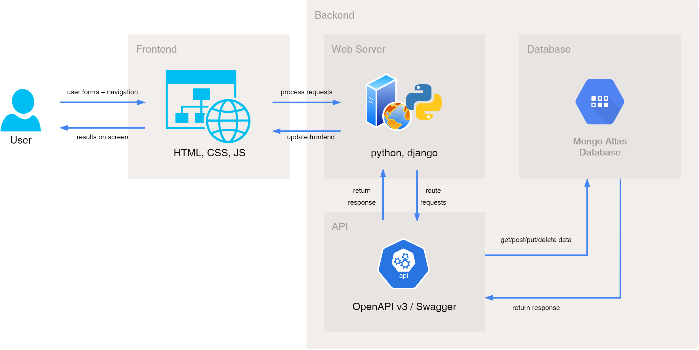

# Goat Boat
# Mission Statement
To connect students with mentors to foster academic growth

# Hill Statements
1. In one minute, a student can find an effective and relatable tutor to study with.
2. A tutor should be able to connect with students at just the touch of a button.
3. A university can subscribe to the service on behalf of students, reducing labor cost.
4. Our team is committed to keeping up-to-date with changing educational circumstances even in a post-pandemic world.

# Branches
Branching on this project is inspired by the Gitflow method of branching. The main branch will be used for all major releases. Updates to main will come directly from the development branch as we do not plan on using release branches. New branches will be made off of dev for each feature that will be developed. Once a feature has been completed and merged into dev, the feature branch will be deleted.

Before merging a branch to dev or main, developers must create a pull request. Each pull request must be reviewed by and meet the standards of two team members other than the developer who authored the pull request.

# Project Summary
Goat Boat is a web application that dynamically pairs students with tutors. When signing up for the service, both students and tutors will be asked to share a few, select details about themselves. Their responses allow our team to find ideal pairs that we guarantee will lead to a better academic experience for our users.

# High Level Design

# Prerequisites

# Installation

# Proper Use

# Acknowledgements

# License Information
